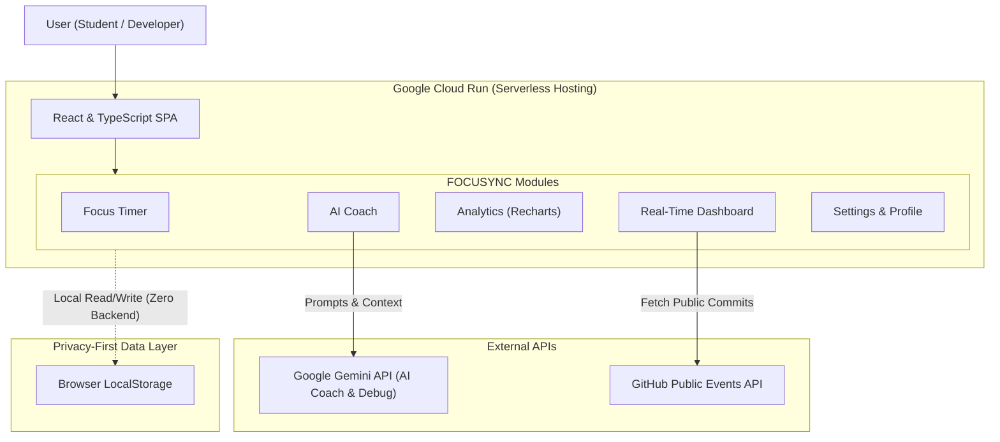

<div align="center">

# 🚀 FOCUSYNC
### Privacy-First Productivity & Burnout-Awareness App

*A productivity app for developers that tracks focus time, visualizes trends, and provides context-aware AI guidance—all while keeping user data local and secure.*


</div>

---

# 📖 Overview

FOCUSYNC is a privacy-first productivity and burnout-awareness app for developers. It helps students and developers track focus time, visualize productivity trends, and receive context-aware AI guidance. 

The core concept follows a simple and effective loop:
1. Users track focus sessions using a timer.
2. The app calculates productivity and burnout risk.
3. An AI Coach analyzes these stats to give personalized advice.

All user data (sessions, moods, settings) is stored **locally in the browser**. No personal data is sent to any backend server, ensuring complete privacy.

> *Focus well. Sync better.*

---

# ✨ Features

- 🧠 **Privacy-First:** 100% localStorage based, no central server or hidden analytics.
- ⏱️ **Pomodoro-Style Timer:** Focus tracking with category selection and smart break reminders.
- 📊 **Real-Time Analytics:** Dashboards for productivity, burnout risk, and weekly focus trends.
- 🤖 **AI Coach:** Gemini-powered context-aware guidance and a "Debug Mode" for clean code output.
- 🐙 **GitHub Integration:** Fetches public commit activity and contribution graphs.
- 💼 **LinkedIn Tracking:** Manual, honest metric tracking for career growth alongside coding.
- 🎨 **Flow-State UI:** Category-based themes and engaging animations.
- 🚨 **Smart Alerts:** Background monitoring for burnout risk and mood check-ins.

---

# 🏗 Architecture



---

# 🛠 Tech Stack

| Category | Technology | Purpose |
|----------|------------|---------|
| **Frontend** | React, TypeScript | Component-based UI and type-safe logic |
| **Styling** | Tailwind CSS | Utility-first styling and dynamic themes |
| **Visualization**| Recharts | Data visualization and analytics charts |
| **AI & APIs** | Gemini API | AI Coach and Debug Mode functionality |
| **Integrations**| GitHub API | Fetches public commit activity |
| **Deployment** | Google Cloud Run | Serverless deployment and scale-to-zero hosting |

---

# 🔐 Privacy & Data Philosophy

FOCUSYNC is built with privacy as a **core design principle**.

- No accounts required
- No backend database
- No tracking scripts
- No hidden analytics

Users can **export their data**, **clear history**, or **delete everything instantly** right from the settings.

---

# 📸 Screenshots

### 🏠 Dashboard


---

### ⏱️ Focus Timer (Flow State)


---

### 📊 Analytics


---

### 🤖 AI Coach


---

### ⚙️ Settings & Profile


---

# ⚙️ Installation & Setup

## 1. Clone the repository
```bash
git clone https://github.com/Khushi1310-nayak/focusync.git
cd focusync
```

## 2. Install dependencies
```bash
npm install
```

## 3. Start the development server
```bash
npm run dev
```

---

# 🤝 Contributing

Contributions are welcome!

Feel free to fork the repository, create a feature branch, and submit a pull request.

---

# 📜 License

This project is licensed under the MIT License.

---

# 👩💻 Author

## **Manisa Nayak**

🎓 Student | Full-Stack Developer | AI Product Builder

Passionate about:
- Full-Stack Architecture
- User Experience (UI/UX)
- AI Automation & Product Building

### Connect with Me

**GitHub:** https://github.com/Khushi1310-nayak  
**LinkedIn:** https://www.linkedin.com/in/manisa-nayak-185bb5378/

---

## ⭐ If you found this project interesting, consider giving it a Star!
