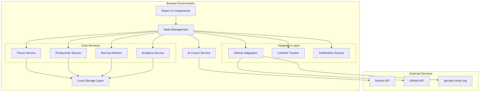

# Design Document: FOCUSYNC

## Overview

FOCUSYNC is a privacy-first productivity and burnout-awareness application built as a single-page React application with TypeScript. The system emphasizes local-only data storage, intelligent AI coaching, and comprehensive productivity tracking without compromising user privacy.

### Core Design Principles

1. **Privacy First**: All user data remains on the device - no external databases or data transmission
2. **Offline Capable**: Full functionality without internet connection after initial load
3. **Modular Architecture**: Clear separation of concerns for maintainability
4. **Progressive Enhancement**: Core features work without external integrations
5. **Performance Focused**: Responsive UI with efficient state management
6. **Accessibility Compliant**: WCAG 2.1 AA standards throughout

### Technology Stack

- **Frontend**: React 18+ with TypeScript, Tailwind CSS for styling
- **Charts**: Recharts for data visualization
- **AI Integration**: Google Gemini API for coaching features
- **External APIs**: GitHub Public Events API, ghchart.rshah.org for contribution graphs
- **Storage**: localStorage with IndexedDB fallback for larger datasets
- **Deployment**: Google Cloud Run with scale-to-zero configuration
- **Build Tools**: Vite for fast development and optimized production builds

## Architecture

### High-Level System Architecture



### Frontend Architecture and Components

#### Component Hierarchy

```
App
├── Layout
│   ├── Header
│   │   ├── ThemeToggle
│   │   ├── SettingsButton
│   │   └── NotificationCenter
│   └── Sidebar
│       ├── Navigation
│       └── QuickStats
├── Routes
│   ├── Dashboard
│   │   ├── FocusTimer
│   │   ├── ProductivityMeter
│   │   ├── BurnoutIndicator
│   │   └── MoodCheckIn
│   ├── Analytics
│   │   ├── ProductivityCharts
│   │   ├── BurnoutTrends
│   │   ├── CategoryBreakdown
│   │   └── GitHubActivity
│   ├── AICoach
│   │   ├── ChatInterface
│   │   ├── DebugMode
│   │   └── RecommendationCards
│   ├── Integrations
│   │   ├── GitHubConnect
│   │   └── LinkedInTracker
│   └── Settings
│       ├── PreferencesPanel
│       ├── DataManagement
│       └── APIKeyManager
└── Providers
    ├── ThemeProvider
    ├── DataProvider
    └── NotificationProvider
```

#### Key Component Specifications

**FocusTimer Component**
- Real-time display with millisecond precision
- Visual progress indicators with category-based theming
- Pause/resume/reset controls with keyboard shortcuts
- Session state persistence across browser refreshes
- Automatic break suggestions at 25-minute intervals

**ProductivityMeter Component**
- Real-time score calculation and display
- Historical trend visualization (7-day rolling average)
- Category-specific productivity breakdowns
- Visual indicators using progress bars and color coding
- Responsive design for mobile and desktop

**BurnoutIndicator Component**
- Risk level visualization (Low/Moderate/High)
- Contributing factors breakdown
- Actionable recommendations based on current risk
- Historical burnout risk trends
- Integration with mood data and work patterns

### State Management Approach

#### Zustand Store Architecture

```typescript
interface AppState {
  // Focus Session State
  focusSession: {
    isActive: boolean;
    isPaused: boolean;
    startTime: number | null;
    pausedTime: number;
    category: string;
    elapsedTime: number;
  };
  
  // Productivity State
  productivity: {
    currentScore: number;
    weeklyTrend: number[];
    categoryScores: Record<string, number>;
    lastCalculated: number;
  };
  
  // Burnout State
  burnout: {
    riskLevel: 'low' | 'moderate' | 'high';
    factors: string[];
    dailyHours: number;
    weeklyPattern: number[];
  };
  
  // User Preferences
  settings: {
    focusGoal: number;
    breakInterval: number;
    notifications: NotificationSettings;
    theme: 'light' | 'dark' | 'auto';
    categories: Category[];
  };
  
  // External Integrations
  integrations: {
    github: GitHubData | null;
    linkedin: LinkedInMetrics[];
    apiKeys: Record<string, string>;
  };
}
```

#### State Management Patterns

1. **Immutable Updates**: All state changes use immer for immutable updates
2. **Computed Values**: Derived state calculated via selectors to prevent unnecessary re-renders
3. **Persistence**: Automatic synchronization with localStorage using middleware
4. **Optimistic Updates**: UI updates immediately with rollback on failure
5. **Action Creators**: Centralized business logic in action creators for consistency

### Data Storage Strategy

#### Local Storage Architecture

```typescript
interface StorageSchema {
  // Core Application Data
  focusSessions: FocusSession[];
  moodEntries: MoodEntry[];
  productivityHistory: ProductivityRecord[];
  burnoutAssessments: BurnoutRecord[];
  
  // User Configuration
  userSettings: UserSettings;
  categories: Category[];
  
  // Integration Data
  githubCache: GitHubCache;
  linkedinMetrics: LinkedInMetric[];
  
  // Metadata
  dataVersion: string;
  lastSync: number;
  installDate: number;
}
```

#### Storage Implementation Strategy

1. **Primary Storage**: localStorage for settings and recent data (< 5MB)
2. **Secondary Storage**: IndexedDB for historical data and large datasets
3. **Data Compression**: JSON compression for historical records
4. **Migration System**: Version-based schema migrations for updates
5. **Backup/Export**: Complete data export in JSON and CSV formats
6. **Cleanup**: Automatic cleanup of old data based on retention policies

#### Data Persistence Patterns

```typescript
class DataManager {
  // Immediate persistence for critical data
  async saveFocusSession(session: FocusSession): Promise<void>;
  
  // Batched persistence for frequent updates
  async batchSaveProductivityData(records: ProductivityRecord[]): Promise<void>;
  
  // Lazy loading for historical data
  async loadHistoricalData(dateRange: DateRange): Promise<HistoricalData>;
  
  // Export functionality
  async exportAllData(): Promise<ExportData>;
  async importData(data: ExportData): Promise<void>;
}
```

## AI Coach Design and Prompt Flow

### AI Coach Architecture

The AI Coach uses a context-aware prompt system that adapts based on user data, current state, and interaction history.

#### Prompt Engineering Strategy

```typescript
interface CoachContext {
  userState: {
    currentProductivity: number;
    burnoutRisk: BurnoutLevel;
    recentMood: MoodEntry[];
    focusPattern: FocusPattern;
  };
  sessionContext: {
    currentCategory: string;
    sessionDuration: number;
    todaysFocus: number;
    weeklyGoals: Goal[];
  };
  preferences: {
    communicationStyle: 'supportive' | 'direct' | 'technical';
    focusAreas: string[];
    avoidTopics: string[];
  };
}
```

#### Prompt Templates

**Base System Prompt**
```
You are FOCUSYNC AI Coach, a supportive productivity assistant focused on developer and student wellbeing. Your responses should be:

1. Supportive and non-toxic, prioritizing mental health
2. Specific and actionable rather than generic
3. Contextually aware of the user's current state
4. Encouraging without being pushy
5. Respectful of work-life balance

Current user context: {contextData}
```

**Debug Mode Prompt**
```
You are now in Debug Mode - a technical expert assistant for developers. Provide:

1. Clean, well-formatted code in Markdown blocks
2. Production-ready solutions with proper error handling
3. Clear explanations of technical concepts
4. Best practices and optimization suggestions
5. Comprehensive code comments

Technical context: {technicalContext}
```

#### Conversation Flow Management

```typescript
class AICoachService {
  async generateResponse(
    userInput: string,
    context: CoachContext,
    mode: 'normal' | 'debug'
  ): Promise<CoachResponse> {
    const prompt = this.buildPrompt(userInput, context, mode);
    const response = await this.geminiAPI.generate(prompt);
    return this.processResponse(response, mode);
  }
  
  private buildPrompt(input: string, context: CoachContext, mode: string): string {
    // Context-aware prompt construction
    // Includes user state, preferences, and conversation history
  }
  
  private processResponse(response: string, mode: string): CoachResponse {
    // Response formatting and validation
    // Code block extraction for debug mode
  }
}
```

### Burnout Calculation Logic

#### Burnout Risk Assessment Algorithm

```typescript
interface BurnoutFactors {
  dailyHours: number;        // Weight: 0.3
  weeklyPattern: number[];   // Weight: 0.25
  moodTrend: number;        // Weight: 0.25
  productivityStress: number; // Weight: 0.2
}

class BurnoutCalculator {
  calculateRisk(factors: BurnoutFactors): BurnoutAssessment {
    const scores = {
      overwork: this.calculateOverworkScore(factors.dailyHours, factors.weeklyPattern),
      mood: this.calculateMoodScore(factors.moodTrend),
      stress: this.calculateStressScore(factors.productivityStress)
    };
    
    const weightedScore = 
      scores.overwork * 0.55 +
      scores.mood * 0.25 +
      scores.stress * 0.2;
    
    return {
      level: this.scoreToLevel(weightedScore),
      factors: this.identifyRiskFactors(scores),
      recommendations: this.generateRecommendations(scores)
    };
  }
  
  private calculateOverworkScore(dailyHours: number, weeklyPattern: number[]): number {
    // Algorithm for detecting overwork patterns
    // Considers daily limits, weekly totals, and consistency
  }
  
  private calculateMoodScore(moodTrend: number): number {
    // Mood trend analysis over past 7 days
    // Detects declining mood patterns
  }
  
  private calculateStressScore(productivityStress: number): number {
    // Productivity pressure indicators
    // Unrealistic goals, constant high-intensity work
  }
}
```

#### Risk Level Thresholds

- **Low Risk** (0-30): Normal work patterns, positive mood trends
- **Moderate Risk** (31-60): Some concerning patterns, needs attention
- **High Risk** (61-100): Multiple risk factors, immediate intervention needed

### GitHub Integration Design

#### Public Data Access Strategy

```typescript
interface GitHubIntegration {
  // Public repository data only
  repositories: PublicRepository[];
  contributions: ContributionData;
  recentActivity: PublicEvent[];
  
  // No access to private repos, issues, or sensitive data
}

class GitHubService {
  async fetchPublicActivity(username: string): Promise<GitHubActivity> {
    // Use GitHub Public Events API
    const events = await this.fetchPublicEvents(username);
    const contributions = await this.fetchContributionGraph(username);
    
    return {
      recentCommits: this.extractCommitMessages(events),
      contributionPattern: contributions,
      activeRepositories: this.getActiveRepos(events),
      languageStats: this.calculateLanguageStats(events)
    };
  }
  
  async fetchContributionGraph(username: string): Promise<ContributionGraph> {
    // Use ghchart.rshah.org for contribution visualization
    const response = await fetch(`https://ghchart.rshah.org/${username}`);
    return this.parseContributionSVG(response);
  }
  
  private extractCommitMessages(events: GitHubEvent[]): CommitSummary[] {
    // Extract commit messages for productivity context
    // Filter for push events and parse commit data
  }
}
```

#### Rate Limiting and Error Handling

```typescript
class GitHubRateLimiter {
  private requestQueue: RequestQueue = new RequestQueue();
  private rateLimitStatus: RateLimitStatus = { remaining: 60, resetTime: 0 };
  
  async makeRequest<T>(request: () => Promise<T>): Promise<T> {
    await this.waitForRateLimit();
    
    try {
      const result = await request();
      this.updateRateLimitStatus();
      return result;
    } catch (error) {
      if (this.isRateLimitError(error)) {
        await this.handleRateLimit();
        return this.makeRequest(request);
      }
      throw error;
    }
  }
}
```

### LinkedIn Manual Metrics Tracking Design

#### Data Input Interface

```typescript
interface LinkedInMetrics {
  date: string;
  profileViews: number;
  postImpressions: number;
  searchAppearances: number;
  connectionRequests: number;
  engagementRate: number;
}

class LinkedInTracker {
  async recordMetrics(metrics: LinkedInMetrics): Promise<void> {
    // Validate input data
    const validated = this.validateMetrics(metrics);
    
    // Store with timestamp
    await this.dataManager.saveLinkedInMetrics({
      ...validated,
      recordedAt: Date.now(),
      id: this.generateId()
    });
    
    // Update analytics
    this.analyticsService.updateLinkedInTrends();
  }
  
  async calculateGrowthRates(period: TimePeriod): Promise<GrowthAnalysis> {
    const metrics = await this.getMetricsForPeriod(period);
    
    return {
      profileViewGrowth: this.calculateGrowthRate(metrics, 'profileViews'),
      impressionGrowth: this.calculateGrowthRate(metrics, 'postImpressions'),
      engagementTrend: this.calculateTrendLine(metrics, 'engagementRate'),
      recommendations: this.generateGrowthRecommendations(metrics)
    };
  }
}
```

#### Manual Input Validation

```typescript
class MetricsValidator {
  validateLinkedInInput(input: Partial<LinkedInMetrics>): ValidationResult {
    const errors: string[] = [];
    
    // Validate numeric ranges
    if (input.profileViews && (input.profileViews < 0 || input.profileViews > 100000)) {
      errors.push('Profile views must be between 0 and 100,000');
    }
    
    // Validate date format
    if (input.date && !this.isValidDate(input.date)) {
      errors.push('Date must be in YYYY-MM-DD format');
    }
    
    // Check for duplicate entries
    if (await this.isDuplicateEntry(input.date)) {
      errors.push('Metrics for this date already exist');
    }
    
    return { isValid: errors.length === 0, errors };
  }
}
```

### Alert and Notification System

#### Notification Architecture

```typescript
interface NotificationSystem {
  // Notification types
  breakReminders: BreakNotification[];
  burnoutAlerts: BurnoutNotification[];
  moodCheckIns: MoodNotification[];
  achievementAlerts: AchievementNotification[];
  
  // User preferences
  preferences: NotificationPreferences;
  doNotDisturbPeriods: TimeRange[];
}

class NotificationService {
  async scheduleBreakReminder(sessionDuration: number): Promise<void> {
    // Calculate optimal break time based on session length and user preferences
    const breakTime = this.calculateBreakTime(sessionDuration);
    
    if (this.shouldShowNotification('break', breakTime)) {
      await this.showNotification({
        type: 'break',
        title: 'Time for a break!',
        message: `You've been focused for ${sessionDuration} minutes. Consider taking a ${breakTime}-minute break.`,
        actions: ['Take Break', 'Continue', 'Snooze 5min']
      });
    }
  }
  
  async checkBurnoutRisk(riskLevel: BurnoutLevel): Promise<void> {
    if (riskLevel === 'high' && this.shouldShowBurnoutAlert()) {
      await this.showNotification({
        type: 'burnout',
        title: 'High burnout risk detected',
        message: 'Your work patterns suggest high burnout risk. Consider taking extended breaks.',
        actions: ['View Recommendations', 'Dismiss', 'Snooze 1hr'],
        priority: 'high'
      });
    }
  }
}
```

#### Smart Notification Timing

```typescript
class NotificationScheduler {
  calculateOptimalTiming(notificationType: NotificationType): number {
    const userActivity = this.getUserActivityPattern();
    const currentContext = this.getCurrentContext();
    
    switch (notificationType) {
      case 'moodCheckIn':
        // Schedule during natural break periods
        return this.findNextBreakWindow(userActivity);
        
      case 'breakReminder':
        // Based on focus session length and productivity curve
        return this.calculateBreakTiming(currentContext.sessionLength);
        
      case 'burnoutAlert':
        // Immediate for high risk, delayed for moderate
        return currentContext.burnoutRisk === 'high' ? 0 : 300000; // 5 minutes
    }
  }
}
```

### Privacy and Security Considerations

#### Data Privacy Architecture

```typescript
interface PrivacyControls {
  dataRetention: {
    focusSessions: number; // days
    moodEntries: number;
    productivityHistory: number;
    analyticsData: number;
  };
  
  dataSharing: {
    aiCoach: boolean; // Local processing only
    analytics: boolean; // No external analytics
    errorReporting: boolean; // Anonymous only
  };
  
  encryption: {
    apiKeys: boolean; // Always encrypted
    sensitiveData: boolean; // Mood, personal notes
    exportData: boolean; // Optional encryption
  };
}

class PrivacyManager {
  async encryptSensitiveData(data: SensitiveData): Promise<EncryptedData> {
    // Use Web Crypto API for client-side encryption
    const key = await this.getOrCreateEncryptionKey();
    const encrypted = await crypto.subtle.encrypt(
      { name: 'AES-GCM', iv: crypto.getRandomValues(new Uint8Array(12)) },
      key,
      new TextEncoder().encode(JSON.stringify(data))
    );
    
    return { encrypted: Array.from(new Uint8Array(encrypted)), iv };
  }
  
  async cleanupExpiredData(): Promise<void> {
    const retentionPolicies = this.getRetentionPolicies();
    
    for (const [dataType, retentionDays] of Object.entries(retentionPolicies)) {
      const cutoffDate = Date.now() - (retentionDays * 24 * 60 * 60 * 1000);
      await this.dataManager.deleteDataOlderThan(dataType, cutoffDate);
    }
  }
}
```

#### API Key Security

```typescript
class APIKeyManager {
  async storeAPIKey(service: string, key: string): Promise<void> {
    // Validate key format
    if (!this.validateKeyFormat(service, key)) {
      throw new Error('Invalid API key format');
    }
    
    // Encrypt before storage
    const encrypted = await this.encryptAPIKey(key);
    
    // Store in secure localStorage
    await this.secureStorage.set(`api_key_${service}`, encrypted);
    
    // Test key validity
    await this.testAPIKey(service, key);
  }
  
  async getAPIKey(service: string): Promise<string | null> {
    const encrypted = await this.secureStorage.get(`api_key_${service}`);
    if (!encrypted) return null;
    
    return this.decryptAPIKey(encrypted);
  }
  
  private async encryptAPIKey(key: string): Promise<EncryptedKey> {
    // Use device-specific encryption key
    const deviceKey = await this.getDeviceEncryptionKey();
    return this.encrypt(key, deviceKey);
  }
}
```

### Deployment Architecture

#### Google Cloud Run Configuration

```yaml
# cloud-run-config.yaml
apiVersion: serving.knative.dev/v1
kind: Service
metadata:
  name: focusync-app
  annotations:
    run.googleapis.com/ingress: all
spec:
  template:
    metadata:
      annotations:
        autoscaling.knative.dev/minScale: "0"
        autoscaling.knative.dev/maxScale: "10"
        run.googleapis.com/cpu-throttling: "true"
    spec:
      containerConcurrency: 1000
      timeoutSeconds: 300
      containers:
      - image: gcr.io/PROJECT_ID/focusync:latest
        ports:
        - containerPort: 8080
        resources:
          limits:
            cpu: "1"
            memory: "512Mi"
          requests:
            cpu: "0.1"
            memory: "128Mi"
        env:
        - name: NODE_ENV
          value: "production"
```

#### Build and Deployment Pipeline

```typescript
// Build configuration for optimal performance
interface BuildConfig {
  // Vite configuration for production
  build: {
    target: 'es2020';
    minify: 'terser';
    sourcemap: false;
    rollupOptions: {
      output: {
        manualChunks: {
          vendor: ['react', 'react-dom'];
          charts: ['recharts'];
          ai: ['@google/generative-ai'];
        };
      };
    };
  };
  
  // Service worker for offline functionality
  pwa: {
    registerType: 'autoUpdate';
    workbox: {
      globPatterns: ['**/*.{js,css,html,ico,png,svg}'];
      runtimeCaching: [
        {
          urlPattern: /^https:\/\/api\.github\.com\//;
          handler: 'CacheFirst';
          options: {
            cacheName: 'github-api-cache';
            expiration: { maxEntries: 50, maxAgeSeconds: 300 };
          };
        }
      ];
    };
  };
}
```

### Cost-Control Strategy

#### Resource Optimization

```typescript
class CostOptimizer {
  // Minimize API calls through intelligent caching
  async optimizeAPIUsage(): Promise<void> {
    // GitHub API: Cache public data for 5 minutes
    this.githubCache.setTTL(300000);
    
    // Gemini API: Batch requests and use context efficiently
    this.aiCoach.enableRequestBatching();
    this.aiCoach.optimizeContextLength();
    
    // Rate limiting to stay within free tiers
    this.rateLimiter.setLimits({
      github: { requests: 60, window: 3600000 }, // 60/hour
      gemini: { requests: 100, window: 86400000 } // 100/day
    });
  }
  
  // Cloud Run optimization
  configureScaleToZero(): void {
    // Ensure proper scale-to-zero configuration
    // Minimize cold start impact through lazy loading
    this.lazyLoadNonCriticalModules();
    this.preloadCriticalResources();
  }
  
  // Monitor usage and costs
  async trackResourceUsage(): Promise<UsageReport> {
    return {
      apiCalls: this.getAPICallCounts(),
      storageUsage: await this.calculateStorageUsage(),
      computeTime: this.getComputeMetrics(),
      estimatedCosts: this.calculateEstimatedCosts()
    };
  }
}
```

#### Free Tier Optimization

```typescript
interface FreeTierLimits {
  github: {
    rateLimit: 60; // requests per hour
    publicDataOnly: true;
  };
  
  gemini: {
    dailyLimit: 100; // requests per day
    contextOptimization: true;
  };
  
  cloudRun: {
    freeRequests: 2000000; // per month
    freeCPUTime: 180000; // seconds per month
    freeMemory: 360000; // GB-seconds per month
  };
}

class FreeTierManager {
  async checkLimits(): Promise<LimitStatus> {
    const usage = await this.getCurrentUsage();
    const limits = this.getFreeTierLimits();
    
    return {
      github: this.calculateRemainingQuota(usage.github, limits.github),
      gemini: this.calculateRemainingQuota(usage.gemini, limits.gemini),
      cloudRun: this.calculateRemainingQuota(usage.cloudRun, limits.cloudRun)
    };
  }
}
```

### Scalability and Future Enhancements

#### Modular Extension Architecture

```typescript
interface ExtensionSystem {
  // Plugin architecture for new integrations
  plugins: {
    integrations: IntegrationPlugin[];
    analytics: AnalyticsPlugin[];
    aiModels: AIModelPlugin[];
  };
  
  // Feature flags for gradual rollouts
  features: {
    advancedAnalytics: boolean;
    teamCollaboration: boolean;
    customAIModels: boolean;
    exportIntegrations: boolean;
  };
}

abstract class IntegrationPlugin {
  abstract name: string;
  abstract version: string;
  
  abstract initialize(): Promise<void>;
  abstract fetchData(): Promise<IntegrationData>;
  abstract validateConfig(config: any): boolean;
}

// Example: Jira integration plugin
class JiraIntegrationPlugin extends IntegrationPlugin {
  name = 'jira';
  version = '1.0.0';
  
  async initialize(): Promise<void> {
    // Initialize Jira API connection
  }
  
  async fetchData(): Promise<JiraData> {
    // Fetch task completion data
  }
}
```

#### Performance Scaling Strategies

```typescript
class PerformanceOptimizer {
  // Virtual scrolling for large datasets
  implementVirtualScrolling(): void {
    // For analytics with thousands of data points
    this.analyticsView.enableVirtualScrolling({
      itemHeight: 50,
      bufferSize: 10,
      overscan: 5
    });
  }
  
  // Web Workers for heavy computations
  async offloadComputation<T>(
    computation: () => T,
    data: any
  ): Promise<T> {
    const worker = new Worker('/workers/computation-worker.js');
    
    return new Promise((resolve, reject) => {
      worker.postMessage({ computation: computation.toString(), data });
      worker.onmessage = (e) => resolve(e.data);
      worker.onerror = reject;
    });
  }
  
  // Progressive data loading
  async loadDataProgressively(
    dateRange: DateRange
  ): Promise<ProgressiveData> {
    // Load recent data first, historical data on demand
    const recentData = await this.loadRecentData(7); // Last 7 days
    const historicalLoader = this.createHistoricalLoader(dateRange);
    
    return { recentData, historicalLoader };
  }
}
```

#### Future Enhancement Roadmap

```typescript
interface FutureEnhancements {
  shortTerm: {
    // 3-6 months
    advancedCharts: 'Interactive productivity heatmaps';
    teamFeatures: 'Basic team productivity sharing';
    mobileApp: 'React Native mobile application';
    exportFormats: 'PDF reports and advanced CSV exports';
  };
  
  mediumTerm: {
    // 6-12 months
    aiPersonalization: 'Personalized AI coaching models';
    integrationHub: 'Plugin marketplace for integrations';
    collaborativeFeatures: 'Team burnout monitoring';
    advancedAnalytics: 'Predictive productivity modeling';
  };
  
  longTerm: {
    // 12+ months
    enterpriseFeatures: 'Organization-wide deployment';
    aiModels: 'Custom AI model training';
    realTimeSync: 'Multi-device synchronization';
    apiPlatform: 'Public API for third-party integrations';
  };
}
```

## Error Handling

### Comprehensive Error Management

```typescript
interface ErrorHandlingStrategy {
  // Network errors
  networkErrors: {
    retryPolicy: ExponentialBackoff;
    fallbackBehavior: OfflineMode;
    userNotification: GracefulDegradation;
  };
  
  // Storage errors
  storageErrors: {
    quotaExceeded: DataCleanup;
    corruptedData: DataRecovery;
    migrationFailure: SafeRollback;
  };
  
  // API errors
  apiErrors: {
    rateLimiting: QueuedRequests;
    authentication: KeyRefresh;
    serviceUnavailable: CachedFallback;
  };
}

class ErrorHandler {
  async handleStorageError(error: StorageError): Promise<void> {
    switch (error.type) {
      case 'QUOTA_EXCEEDED':
        await this.cleanupOldData();
        await this.compressHistoricalData();
        break;
        
      case 'CORRUPTED_DATA':
        await this.attemptDataRecovery();
        await this.notifyUserOfDataLoss();
        break;
        
      case 'MIGRATION_FAILED':
        await this.rollbackToSafeState();
        await this.scheduleRetryMigration();
        break;
    }
  }
  
  async handleAPIError(error: APIError): Promise<APIResponse> {
    if (error.status === 429) { // Rate limited
      const retryAfter = error.headers['retry-after'] || 60;
      await this.delay(retryAfter * 1000);
      return this.retryRequest(error.request);
    }
    
    if (error.status === 401) { // Unauthorized
      await this.refreshAPIKey(error.service);
      return this.retryRequest(error.request);
    }
    
    // Fallback to cached data
    return this.getCachedResponse(error.request);
  }
}
```

### Testing Strategy

The testing strategy will combine unit tests for specific functionality with property-based tests for comprehensive validation of system behavior across all possible inputs.

#### Unit Testing Approach

Unit tests will focus on:
- **Component behavior**: Testing React components with specific props and state
- **Service integration**: Testing API integrations with mocked responses
- **Edge cases**: Testing boundary conditions and error scenarios
- **User interactions**: Testing UI workflows and user input validation

#### Property-Based Testing Approach

Property-based tests will validate universal properties using a minimum of 100 iterations per test. Each test will be tagged with references to the corresponding design properties.

**Testing Framework Configuration**:
- **Unit Tests**: Jest with React Testing Library
- **Property Tests**: fast-check library for TypeScript
- **Integration Tests**: Playwright for end-to-end testing
- **Performance Tests**: Lighthouse CI for performance regression detection

**Property Test Configuration**:
```typescript
// Example property test configuration
describe('Focus Timer Properties', () => {
  it('should maintain time consistency across pause/resume cycles', 
    fc.property(
      fc.array(fc.boolean(), { minLength: 1, maxLength: 10 }),
      (pauseResumeSequence) => {
        // Property: Total elapsed time should equal sum of active periods
        // Tag: Feature: focusync, Property 1: Timer consistency
      }
    ), { numRuns: 100 }
  );
});
```

Both testing approaches are complementary and necessary:
- **Unit tests** catch specific bugs and validate concrete examples
- **Property tests** verify general correctness across all possible inputs
- **Together** they provide comprehensive coverage ensuring both specific functionality and universal properties hold true

## Correctness Properties

*A property is a characteristic or behavior that should hold true across all valid executions of a system—essentially, a formal statement about what the system should do. Properties serve as the bridge between human-readable specifications and machine-verifiable correctness guarantees.*

Based on the prework analysis and property reflection, the following correctness properties ensure FOCUSYNC behaves correctly across all possible inputs and states:

### Timer and Session Management Properties

**Property 1: Timer State Consistency**
*For any* focus timer state and sequence of user actions (start, pause, resume, reset), the timer should maintain consistent elapsed time calculations and state transitions
**Validates: Requirements 1.1, 1.2, 1.3, 1.5**

**Property 2: Session Persistence**
*For any* active focus session, browser refresh should preserve the session state until manual reset, maintaining elapsed time and category association
**Validates: Requirements 1.5**

**Property 3: Break Notification Timing**
*For any* focus session reaching 25 minutes, the system should trigger break notifications consistently
**Validates: Requirements 1.4**

### Category and Classification Properties

**Property 4: Category Association Consistency**
*For any* focus session with selected category, the session should maintain its category association throughout its lifecycle and in stored data
**Validates: Requirements 2.2, 2.3, 2.4**

**Property 5: Custom Category Management**
*For any* user-created custom category, it should behave identically to predefined categories in terms of selection, theming, and statistics tracking
**Validates: Requirements 2.5**

### Productivity and Analytics Properties

**Property 6: Productivity Score Calculation**
*For any* set of focus sessions over a 7-day period, productivity scores should be calculated consistently based on duration, frequency, and consistency metrics
**Validates: Requirements 3.1, 3.4, 3.5**

**Property 7: Real-time Score Updates**
*For any* active focus session with changing productivity patterns, score updates should reflect changes immediately and consistently
**Validates: Requirements 3.2**

**Property 8: Analytics Data Filtering**
*For any* analytics query with date range and category filters, the returned data should contain only records matching all specified criteria
**Validates: Requirements 10.4**

### Burnout Detection Properties

**Property 9: Burnout Risk Assessment**
*For any* combination of daily hours, mood patterns, and work consistency, burnout risk calculation should increase monotonically with risk factors
**Validates: Requirements 4.1, 4.2, 4.3, 4.4**

**Property 10: Graduated Warning System**
*For any* burnout risk level transition (low → moderate → high), the system should provide appropriately escalated warnings and recommendations
**Validates: Requirements 4.4**

### Data Storage and Privacy Properties

**Property 11: Local Data Storage**
*For any* user data (sessions, mood, settings, API keys), storage should occur exclusively in browser local storage with no external transmission
**Validates: Requirements 5.2, 9.2, 13.1, 15.1**

**Property 12: Data Export Completeness**
*For any* data export request, the exported data should contain all user data in the specified format (JSON/CSV) and be importable back into the system
**Validates: Requirements 10.5, 13.2**

**Property 13: Data Deletion Completeness**
*For any* data deletion request with confirmation, all stored user data should be permanently and completely removed from local storage
**Validates: Requirements 13.3**

### AI Coach Properties

**Property 14: Context-Aware Advice Generation**
*For any* user state (productivity, mood, burnout risk), AI coach advice should be contextually appropriate and prioritize wellbeing over productivity when risks are detected
**Validates: Requirements 6.1, 6.4**

**Property 15: Debug Mode Code Formatting**
*For any* code response in debug mode, the output should be formatted as clean Markdown code blocks with proper syntax highlighting
**Validates: Requirements 7.2**

**Property 16: Mode Switching Consistency**
*For any* transition between normal and debug mode, the AI coach should maintain conversation context while adapting its response style appropriately
**Validates: Requirements 7.1, 7.5**

### Integration Properties

**Property 17: GitHub Public Data Access**
*For any* GitHub integration request, only public repository data and contribution graphs should be accessed, with no private data requests
**Validates: Requirements 8.1, 8.2**

**Property 18: API Error Handling**
*For any* external API failure (GitHub, Gemini), the system should continue functioning normally with graceful degradation and appropriate user feedback
**Validates: Requirements 8.4, 8.5, 15.4**

**Property 19: LinkedIn Growth Calculation**
*For any* sequence of LinkedIn metrics over time, growth rates should be calculated correctly and significant changes should be highlighted appropriately
**Validates: Requirements 9.5**

### Notification and Settings Properties

**Property 20: Notification Timing Respect**
*For any* user notification preferences and "do not disturb" settings, notifications should be delivered only during allowed periods and with specified frequency
**Validates: Requirements 11.1, 11.4, 11.5**

**Property 21: Settings Application Immediacy**
*For any* settings change, the new configuration should take effect immediately without requiring application restart
**Validates: Requirements 12.3**

**Property 22: Settings Validation**
*For any* settings input, invalid configurations should be rejected with helpful error messages, and valid configurations should be accepted and applied
**Validates: Requirements 12.5**

### Performance and Accessibility Properties

**Property 23: Offline Functionality**
*For any* core application feature, functionality should remain available when offline after initial application load
**Validates: Requirements 13.4**

**Property 24: Performance Consistency**
*For any* user interaction during active focus sessions, response times should remain within acceptable bounds regardless of data size or session duration
**Validates: Requirements 14.2**

**Property 25: Accessibility Compliance**
*For any* user interface element, keyboard navigation and screen reader compatibility should meet WCAG 2.1 AA standards
**Validates: Requirements 14.3**

**Property 26: Mobile Touch Responsiveness**
*For any* user interaction on mobile devices, touch targets should be appropriately sized and responsive across different screen sizes
**Validates: Requirements 14.5**

### Security Properties

**Property 27: API Key Encryption**
*For any* stored API key, it should be encrypted in local storage and decrypted only when needed for API calls
**Validates: Requirements 15.1**

**Property 28: API Key Validation**
*For any* API key input, validation should occur before storage, and invalid keys should be rejected with clear error messages
**Validates: Requirements 15.2**

**Property 29: API Key Management**
*For any* API key update or removal operation, the changes should be applied immediately and reflected in subsequent API calls
**Validates: Requirements 15.5**

## Testing Strategy

The testing strategy combines unit tests for specific functionality with property-based tests for comprehensive validation of system behavior across all possible inputs.

### Unit Testing Approach

Unit tests focus on:
- **Component Behavior**: Testing React components with specific props and state combinations
- **Service Integration**: Testing API integrations with mocked responses and error conditions  
- **Edge Cases**: Testing boundary conditions, empty states, and error scenarios
- **User Workflows**: Testing complete user interaction flows and state transitions

### Property-Based Testing Approach

Property-based tests validate universal properties using fast-check library with a minimum of 100 iterations per test. Each test is tagged with references to the corresponding design properties.

**Testing Framework Configuration**:
- **Unit Tests**: Jest with React Testing Library for component testing
- **Property Tests**: fast-check library for TypeScript property-based testing
- **Integration Tests**: Playwright for end-to-end user workflow testing
- **Performance Tests**: Lighthouse CI for performance regression detection
- **Accessibility Tests**: axe-core for automated accessibility validation

**Property Test Example Configuration**:
```typescript
describe('Focus Timer Properties', () => {
  it('should maintain timer state consistency across operations', 
    fc.property(
      fc.array(fc.oneof(
        fc.constant('start'),
        fc.constant('pause'), 
        fc.constant('resume'),
        fc.constant('reset')
      ), { minLength: 1, maxLength: 20 }),
      (operations) => {
        // Property 1: Timer State Consistency
        // Tag: Feature: focusync, Property 1: Timer state consistency
        const timer = new FocusTimer();
        // Test implementation validates state consistency
      }
    ), { numRuns: 100 }
  );
});
```

**Dual Testing Benefits**:
- **Unit tests** catch specific bugs and validate concrete examples and integration points
- **Property tests** verify general correctness across all possible inputs and edge cases
- **Together** they provide comprehensive coverage ensuring both specific functionality and universal properties hold true across the entire application